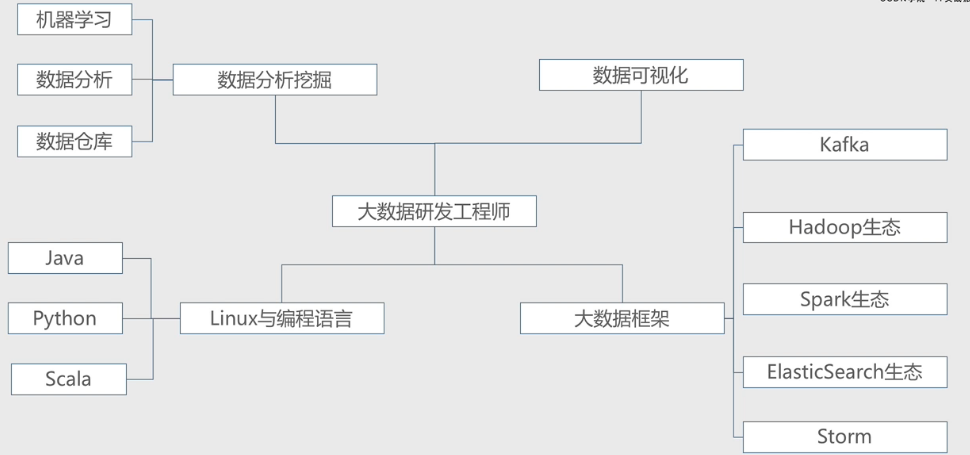

# 大数据学习之路

**大数据技能栈**

# 大数据通用处理平台
1. Spark
2. Flink
3. Hadoop

# 分布式存储
HDFS

# 资源调度
Yarn
Mesos

# 机器学习工具

Mahout

1. Spark Mlib
2. TensorFlow (Google 系)
3. Amazon Machine Learning
4. DMTK (微软分布式机器学习工具)

# 数据分析/数据仓库(SQL类)

1. Pig
2. Hive
3. kylin
4. Spark SQL,
5. Spark DataFrame
6. Impala
7. Phoenix
8. ELK
    - ElasticSearch
    - Logstash
    - Kibana

# 消息队列
1. Kafka(纯日志类，大吞吐量)
2. RocketMQ
3. ZeroMQ
4. ActiveMQ
5. RabbitMQ

# 流式计算
1. Storm/JStorm
2. Spark Streaming
3. Flink

# 日志收集

1. Scribe
2. Flume

# 编程语言
1. Java
2. Python
3. R
4. Ruby
5. Scala

# 算法
## 一致性
1. paxos
2. raft
3. gossip

## 数据结构
1. 栈，队列，链表
2. 散列表
3. 二叉树，红黑树，B树
4. 图

## 常用算法
1. 排序
    - 插入排序
    - 桶排序
    - 堆排序
2. 快速排序
3. 最大子数组
4. 最长公共子序列
5. 最小生成树
6. 最短路径
    - 矩阵的存储和运算

# 数据分析挖掘
MATLAB、SPSS、SAS

# 数据可视化
1. R
2. D3.js
3. ECharts
4. Excle
5. Python

# 机器学习
## 机器学习基础
1. 聚类
2. 时间序列
3. 推荐系统
4. 回归分析
5. 文本挖掘
6. 决策树
7. 支持向量机
8. 贝叶斯分类
9. 神经网络
## 机器学习工具
1. Mahout
2. Spark Mlib
3. TensorFlow (Google 系)
4. Amazon Machine Learning
5. DMTK (微软分布式机器学习工具)

# 云计算
## 云服务

1. SaaS
2. PaaS
3. IaaS
4. Openstack
5. Docker

# 大数据课程

1. [大数据课程与案例](https://edu.csdn.net/course/play/7300)
	
# 参考
1. [尚硅谷大数据](http://www.atguigu.com/bigdata)
2. [一篇文看懂Hadoop：风雨十年，未来何去何从](http://mp.weixin.qq.com/s?__biz=MzU1NjI0ODkxNw==&mid=100000901&idx=1&sn=fd39f5cc15761c748186d3dfe0340a31&chksm=7bc6bebf4cb137a96fc452ef181e2c0da74109c1af9b243d8bddb8796f34ec7e7aa13b10ef9b&mpshare=1&scene=23&srcid=0329JuU5c4wiKRDWZARTSoe9#rd)
3. [在Kubernetes平台上运行Hadoop的实践](http://mp.weixin.qq.com/s?__biz=MzA5OTAyNzQ2OA==&mid=2649697424&idx=1&sn=fbfc282353d2bc15905d6b6d07a3ddf4&chksm=889313f3bfe49ae54cdb4990d5f9e5ec2f7187717126fd457d3f1433fb5c4d69a9b4f5458645&mpshare=1&scene=23&srcid=0409opJ0paCZpvX9aXfd3xat#rd)

----------------------------------------

**项目规范**

本文使用 [`Markdown`](https://www.markdownguide.org/basic-syntax) 编写, 排版符合[`中文技术文档写作规范`](https://github.com/hbulpf/document-style-guide)。Find Me On [**Github**](https://github.com/hbulpf/bigdata_path) , [**Gitee**](https://gitee.com/sifangcloud/bigdata_path)

**友情贡献**

@[**RunAtWorld**](http://www.github.com/RunAtWorld)  &nbsp; 
##### 如果觉得还不错，关注公众号获取更多优质文章 ~

##### 微信搜一搜：四方云和
