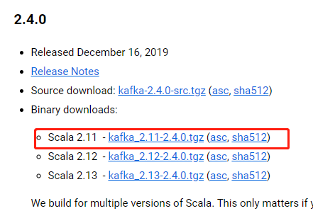
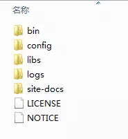
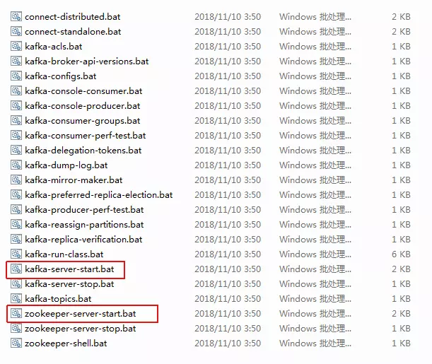
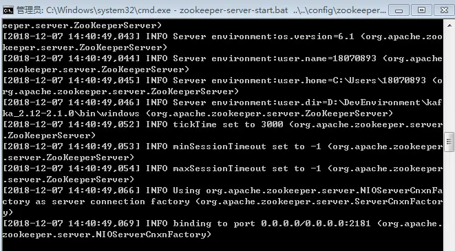
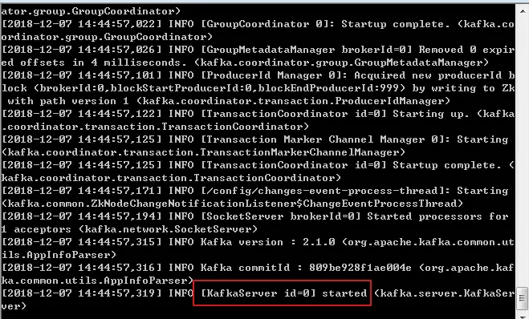
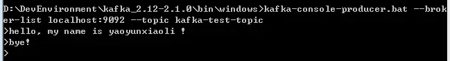
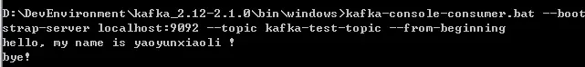

## 在Windows下安装使用Kafka

准备工作: 

1. Java环境
2. Kafka安装包（已包含zookeeper）

## 安装步骤

### 1 Java安装

自行百度

### 2 下载、安装Kafka

1. 打开[Kafka下载地址](http://kafka.apache.org/downloads.html)

2. 选择下图红框中的版本，Kafka包名组成： Scala版本 - Kafka自身版本

   

   下载页

3. 下载完成之后解压，目录如下图：

   

### 3 启动服务

#### 3.1 启动ZooKeeper

打开kafka_2.12-2.1.0\bin\windows目录，该目录下是所有windows命令：

在此目录下打开cmd，执行命令`zookeeper-server-start.bat ..\..\config\zookeeper.properties`，如下图：
 

#### 3.2 启动Kafka

依旧在目录下打开cmd，执行命令`kafka-server-start.bat ..\..\config\server.properties`，如下图：
 

OK，启动成功。
 注意：
 如果出现‘命令语法不正确’ ，导致不能正常运行，尝试修改配置文件的dataDir（zookeeper.properties），log.dirs（server.properties）。因为默认的是linux的文件目录格式。

### 4 测试Kafka命令

- 创建一个主题
   `kafka-topics.bat --create --zookeeper localhost:2181 --replication-factor 1 --partitions 1 --topic kafka-test-topic` 
- 查看创建的主题列表
   `kafka-topics.bat --list --zookeeper localhost:2181` 

执行完上面两条命令后如下图：

- 启动生产者：
   `kafka-console-producer.bat --broker-list localhost:9092 --topic kafka-test-topic`
   此时可以从控制台输入信息，待消费者启动后可接收到生产者发布的消息。
    
   

  

- 启动消费者：
   `kafka-console-consumer.bat --bootstrap-server localhost:9092 --topic kafka-test-topic --from-beginning`
   此时便能看到发布出去的消息了
    
   

# 参考

1. [在Windows下安装使用Kafka](https://www.jianshu.com/p/ce203d4e2f41)